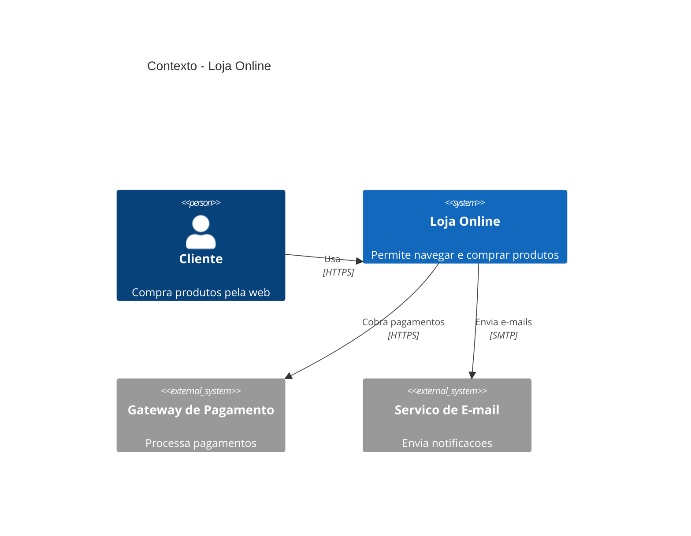
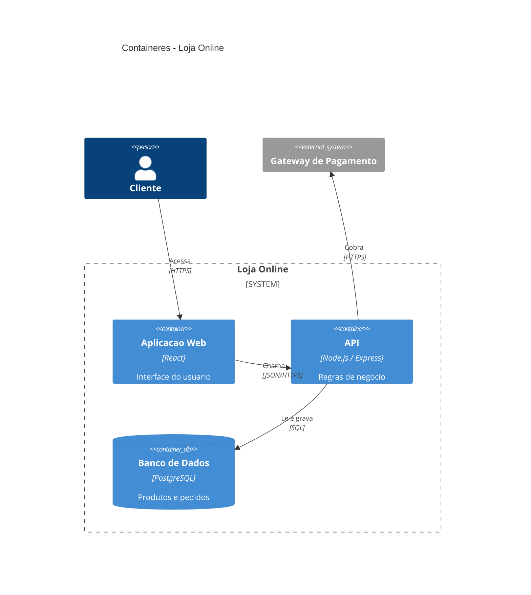
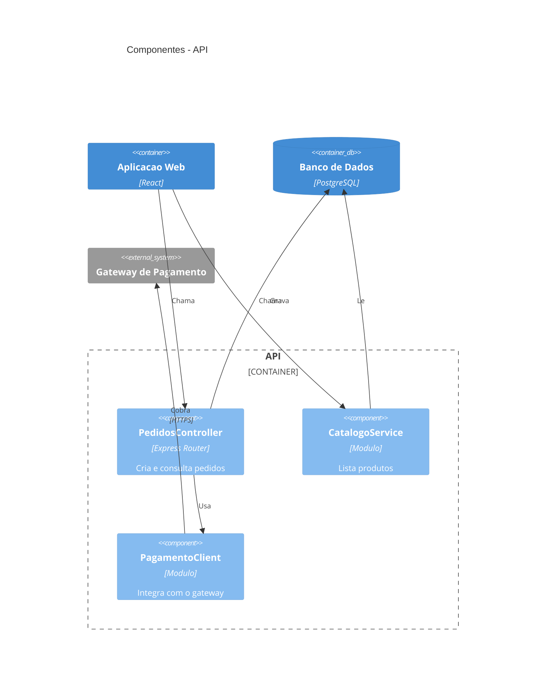

# Exemplo C4 Model – Loja Online

Diagramas em Mermaid (sintaxe C4), renderizados nativamente pelo GitHub.

## Nível 1 – Contexto

```mermaid
C4Context
    title Contexto - Loja Online
    Person(cliente, "Cliente", "Compra produtos pela web")
    System(loja, "Loja Online", "Permite navegar e comprar produtos")
    System_Ext(pagamento, "Gateway de Pagamento", "Processa pagamentos")
    System_Ext(email, "Servico de E-mail", "Envia notificacoes")
    Rel(cliente, loja, "Usa", "HTTPS")
    Rel(loja, pagamento, "Cobra pagamentos", "HTTPS")
    Rel(loja, email, "Envia e-mails", "SMTP")
```

## Nível 2 – Contêineres

```mermaid
C4Container
    title Containeres - Loja Online
    Person(cliente, "Cliente")
    System_Boundary(loja, "Loja Online") {
        Container(web, "Aplicacao Web", "React", "Interface do usuario")
        Container(api, "API", "Node.js / Express", "Regras de negocio")
        ContainerDb(db, "Banco de Dados", "PostgreSQL", "Produtos e pedidos")
    }
    System_Ext(pagamento, "Gateway de Pagamento")
    Rel(cliente, web, "Acessa", "HTTPS")
    Rel(web, api, "Chama", "JSON/HTTPS")
    Rel(api, db, "Le e grava", "SQL")
    Rel(api, pagamento, "Cobra", "HTTPS")
```

## Nível 3 – Componentes (API)

```mermaid
C4Component
    title Componentes - API
    Container(web, "Aplicacao Web", "React")
    ContainerDb(db, "Banco de Dados", "PostgreSQL")
    System_Ext(pagamento, "Gateway de Pagamento")
    Container_Boundary(api, "API") {
        Component(pedidos, "PedidosController", "Express Router", "Cria e consulta pedidos")
        Component(catalogo, "CatalogoService", "Modulo", "Lista produtos")
        Component(pag, "PagamentoClient", "Modulo", "Integra com o gateway")
    }
    Rel(web, pedidos, "Chama")
    Rel(web, catalogo, "Chama")
    Rel(pedidos, pag, "Usa")
    Rel(pedidos, db, "Grava")
    Rel(catalogo, db, "Le")
    Rel(pag, pagamento, "Cobra", "HTTPS")
```
