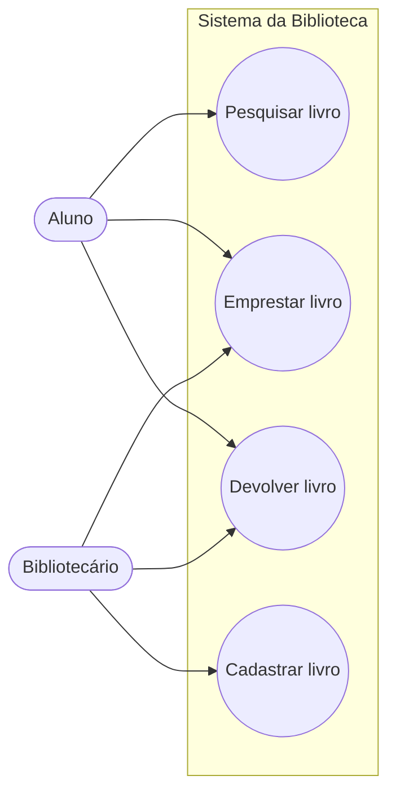

# Casos de uso — Biblioteca

Mostra **quem** usa o sistema e **o que** ele pode fazer.

```mermaid
flowchart LR
    A([Aluno])
    B([Bibliotecário])
    subgraph Sistema da Biblioteca
        U1((Pesquisar livro))
        U2((Emprestar livro))
        U3((Devolver livro))
        U4((Cadastrar livro))
    end
    A --> U1
    A --> U2
    A --> U3
    B --> U2
    B --> U3
    B --> U4
```
