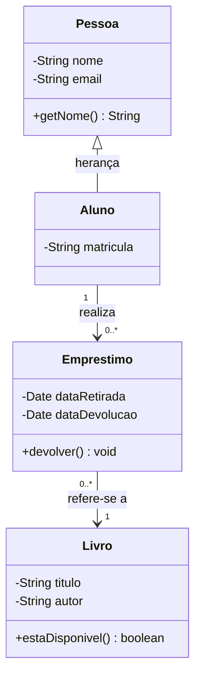

# Classes — Biblioteca

Mostra a estrutura estática: classes, atributos, métodos e relacionamentos.

```mermaid
classDiagram
    class Pessoa {
        -String nome
        -String email
        +getNome() String
    }
    class Aluno {
        -String matricula
    }
    class Livro {
        -String titulo
        -String autor
        +estaDisponivel() boolean
    }
    class Emprestimo {
        -Date dataRetirada
        -Date dataDevolucao
        +devolver() void
    }
    Pessoa <|-- Aluno : herança
    Aluno "1" --> "0..*" Emprestimo : realiza
    Emprestimo "0..*" --> "1" Livro : refere-se a
```
