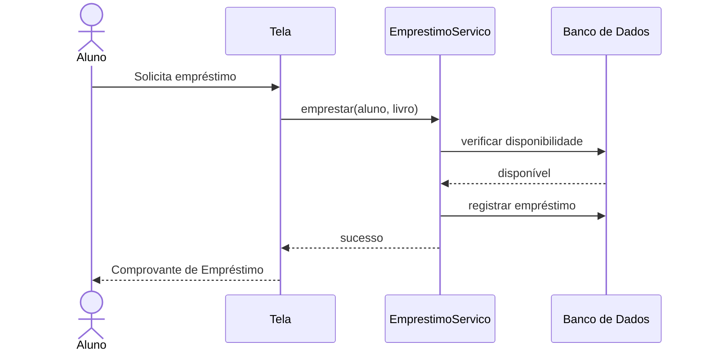

# Sequência — Empréstimo de livro

Mostra a **ordem das mensagens** trocadas entre os objetos.

```mermaid
sequenceDiagram
    actor Aluno
    participant Tela
    participant Servico as EmprestimoServico
    participant BD as Banco de Dados
    Aluno->>Tela: Solicita empréstimo
    Tela->>Servico: emprestar(aluno, livro)
    Servico->>BD: verificar disponibilidade
    BD-->>Servico: disponível
    Servico->>BD: registrar empréstimo
    Servico-->>Tela: sucesso
    Tela-->>Aluno: Comprovante de Empréstimo
```
