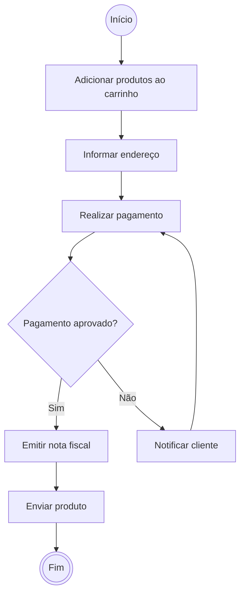

# Atividades — Fluxo de compra online

Mostra o **fluxo** de um processo, com decisões.

```mermaid
flowchart TD
    I((Início)) --> A[Adicionar produtos ao carrinho]
    A --> B[Informar endereço]
    B --> C[Realizar pagamento]
    C --> D{Pagamento aprovado?}
    D -- Sim --> E[Emitir nota fiscal]
    E --> F[Enviar produto]
    D -- Não --> G[Notificar cliente]
    G --> C
    F --> Z(((Fim)))
```
