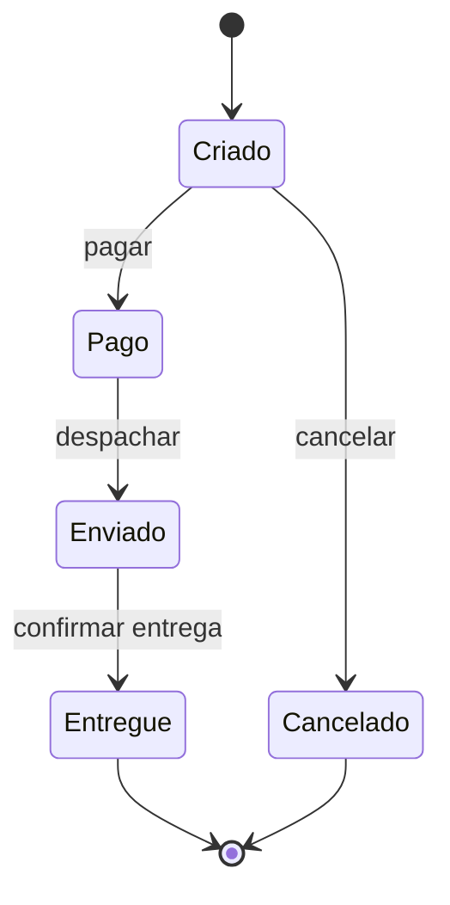

# Estados — Pedido

Mostra os **estados** de um objeto e as transições entre eles.

```mermaid
stateDiagram-v2
    [*] --> Criado
    Criado --> Pago : pagar
    Criado --> Cancelado : cancelar
    Pago --> Enviado : despachar
    Enviado --> Entregue : confirmar entrega
    Entregue --> [*]
    Cancelado --> [*]
```
