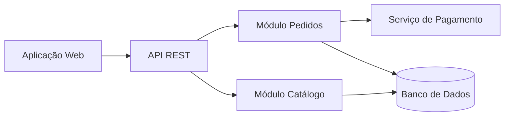

# Componentes — Loja virtual

Mostra os **módulos** do sistema e suas dependências.

```mermaid
flowchart LR
    Web[Aplicação Web] --> API[API REST]
    API --> Pedidos[Módulo Pedidos]
    API --> Catalogo[Módulo Catálogo]
    Pedidos --> Pagamento[Serviço de Pagamento]
    Pedidos --> DB[(Banco de Dados)]
    Catalogo --> DB
```
